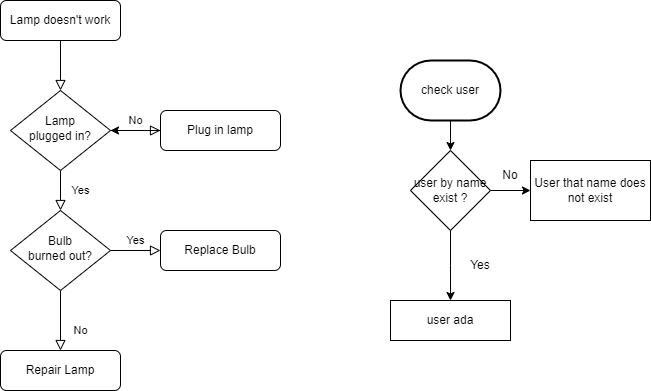

# Daily Task 1 Chapter 2

- step by step :
generate random json dengan key nya :
```
[
  '{{repeat(10, 7)}}',
  {
    _id: '{{objectId()}}',
    name: '{{firstName()}} {{surname()}}',  
    eyeColor: '{{random("blue", "brown", "green")}}',
    age: '{{integer(20, 40)}}',
    balance: '{{floating(1000, 4000, 2, "$0,0.00")}}',
    gender: '{{gender()}}',
    company: '{{company().toUpperCase()}}',
    email: '{{email()}}',
    phone: '+1 {{phone()}}',
    address: '{{integer(100, 999)}} {{street()}}, {{city()}}, {{state()}}, {{integer(100, 10000)}}',
    registered: '{{date(new Date(2014, 0, 1), new Date(), "YYYY-MM-ddThh:mm:ss Z")}}',
    friends: [
      '{{repeat(3)}}',
      {
        id: '{{index()}}',
        name: '{{random("Imam", "Irfi", "Adrian", "Adella", "Grace", "Alim")}}'
      }
    ],
    favoriteFruit: function (tags) {
      var fruits = ['apple', 'banana', 'strawberry'];
      return fruits[tags.integer(0, fruits.length - 1)];
    }
  }
]
```
- kerjakan dengan tim, tapi tiap orang push ke repo akun github nya masing2, cantumkan nomer kelompok nya seperti : CH2-Kel3-dailytask1-...
- note : split soalnya dengan teman se tim mu dan setiap soal gunakan ur own logic dalam penyelesaiannya
- setiap orang mengerti penyelesaian setiap soal walaupun soal nya dikerjakan oleh temen se tim nya, jadi saling share solution dan diskusi. Nanti di kelas akan ditanya random student utk soal yg random juga
- gunakan data dari random json generator untuk data yang kamu olah utk setiap soal
- buat diagram flowchart utk salah satu soal yg kalian kerjakan, dan lampirkan image nya di readme markdown
- setiap soal berikan komment di code nya untuk penjelasan algoritma/step by step nya
- setiap soal di buat dalam file berbeda yah
- setiap soal dibuat dalam function untuk penyelesaiannya, jangan lupa return dari function nya
- Tolong kerjakan dengan kemampuan kalian dulu, jangan andalkan google dan lainnya. latih ur own logic sampe pusing, console.log itu kunci, banyak main terus disitu, kalau sudah merasa kesulitan boleh menggunakan array method.
#### Deadline Rabu, 6 September 2023
setiap tim presentasi hasil pengerjaannya dan nanti aku random tunjuk anggota tim nya untuk jelaskan hasil pengerjaan soal nya. contoh : aku tunjuk Ale untuk menjelaskan hasil pengerjaan no 16 (walaupun Ale tidak mengerjakan no 16)

### soal nya :
1) contoh soal = tentukan user yang mempunyai buah favorit dia nya banana
2) tentukan user yang gender female dan ada berapa jumlah user nya 
3) tentukan user yang registered pada tahun 2014 sampai dengan 2018 dan ada berapa jumlah user nya 
4) tentukan user yang mempunya friend bernama Imam dan ada berapa jumlah user nya
5) tentukan user yang eyeColor nya blue dan ada berapa jumlah nya
6) tentukan user yang gender female ATAU user yang eyeColor nya brown dan ada berapa jumlah user nya 
7) tentukan user yang tidak mempunya teman bernama Irfi dan Adella dan ada berapa jumlah nya
8) tentukan user yang company huruf depan nya berawal L dan ada berapa jumlah user nya
9) tentukan user yang company huruf belakang nya berawal E dan ada berapa jumlah user nya
10) tentukan user yang berumur dibawah 30 dan registered sesudah tahun 2018 dan berapa jumlah nya
11) tentukan user yang mempunyai teman bernama Grace dan favorit fruit nya apple atau banana
12) tentukan user yang mempunyai nama kurang dari 10 karakter dan umur nya diatas 30 atau gender nya Male dan eyeColor nya brown
13) setiap nama dari user tukar nama belakang dan depan nya, contoh = "imam taufiq" menjadi "taufiq imam"
14) rubah setiap company user menjadi binar dan pada email setiap user berubah menjadi @binar.org, contoh = imam@fsw2.com menjadi imam@binar.org
15) rubah user yang gender female address nya menjadi laut, dan user yang gender male address nya gunung
### soal nomer 16 - 24 dapat diliat dalam file nya
#### Note : tim poin terbaik kerjasama, hasil pengerjaan dan saat presentasi nya akan mendapatkan reward dan tim dengan poin terkecil akan mendapatkan punishment hehe

diagram flowchart kamu :
  